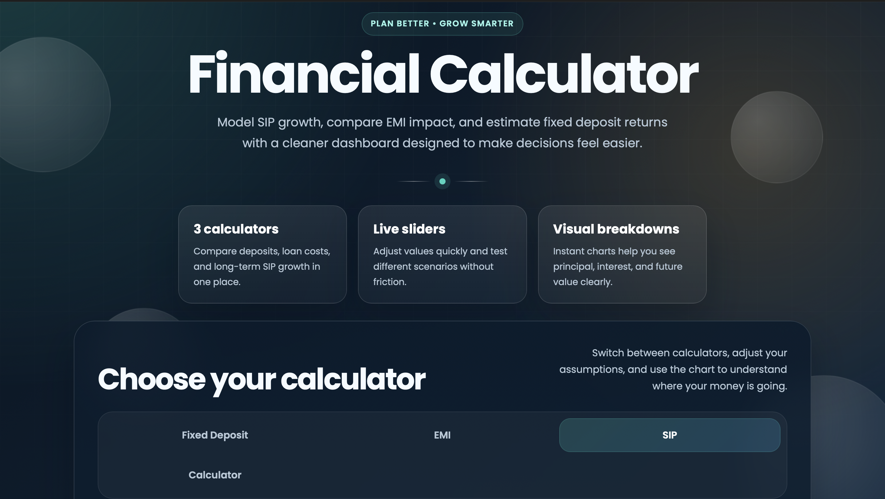
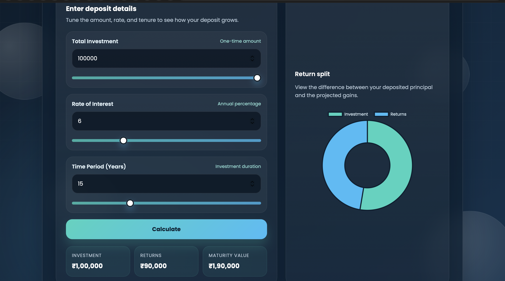
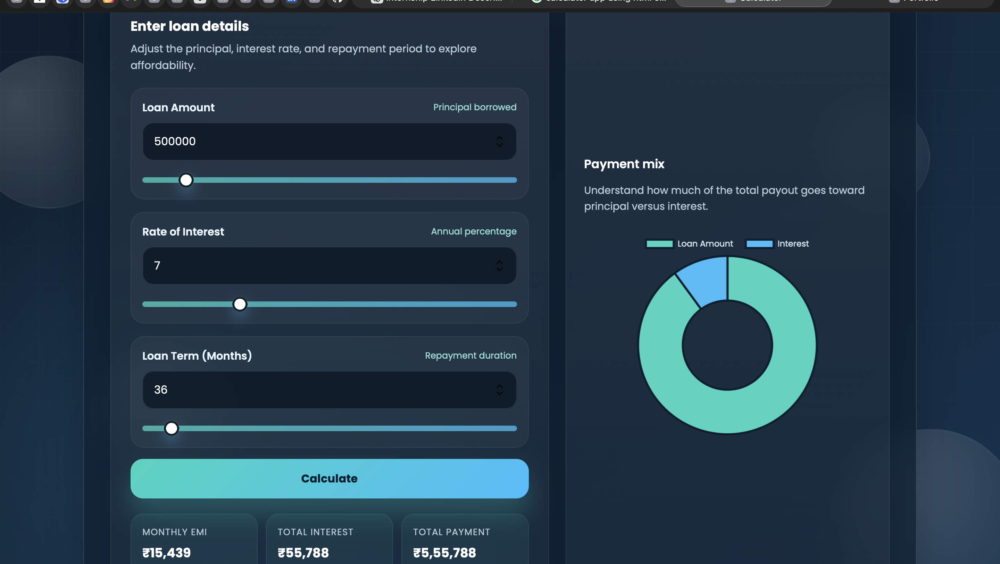
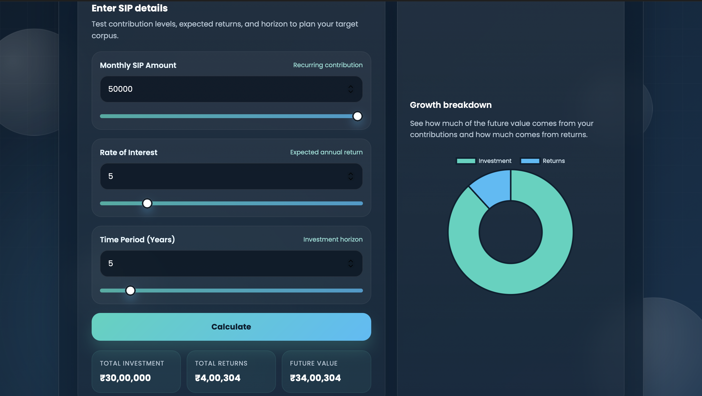
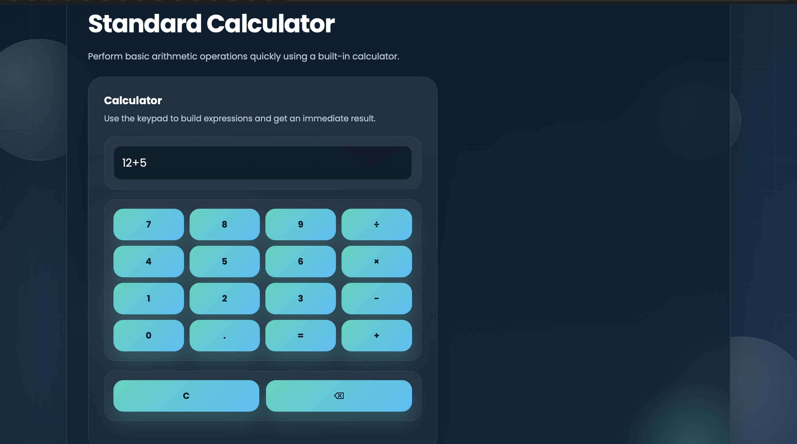

# 💰 Interactive Financial Calculator Web App


---

## 🚀 Live Demo

👉 (http://127.0.0.1:5501/calculator.html)

---

## 📌 Project Overview

The **Interactive Financial Calculator Web App** is a modern and responsive web application designed to help users make smarter financial decisions.

It provides multiple calculators in one place:

* 📊 Fixed Deposit (FD) Calculator
* 💳 EMI Calculator
* 📈 SIP Calculator
* ➕ Basic Calculator

Users can input values using sliders or fields and instantly see results along with **interactive charts**.

---

## 🖼️ Screenshots

### 🔹 Home / Dashboard



### 🔹 FD Calculator



### 🔹 EMI Calculator



### 🔹 SIP Calculator



### 🔹 Standard Calculator



---

## ✨ Features

* ⚡ Real-time financial calculations
* 📊 Interactive charts using Chart.js
* 🎚️ Slider-based inputs for better UX
* 📱 Fully responsive design
* 🎨 Clean UI with animations
* 🔄 Dynamic updates without page reload

---

## 🛠️ Tech Stack

### 🔹 Frontend

* HTML5
* CSS3
* JavaScript (ES6)

### 🔹 Libraries

* Chart.js

---

## 📊 Calculators Included

### 💰 Fixed Deposit (FD)

* Calculates maturity value
* Shows interest earned

### 💳 EMI Calculator

* Monthly EMI
* Total interest
* Total repayment

### 📈 SIP Calculator

* Future value
* Total investment
* Returns

### ➕ Basic Calculator

* Arithmetic operations

---

## 📂 Project Structure

```
📁 financial-calculator
 ┣ 📁 screenshots
 ┣ 📄 index.html
 ┣ 📄 style.css
 ┣ 📄 script.js
 ┗ 📄 README.md
```

---

## 🔮 Future Enhancements

* 🔐 User authentication
* 📊 Save previous calculations
* 🌐 API integration for real-time financial data
* 📱 Mobile app version
* 🤖 AI-based financial suggestions

---

## 🤝 Contributing

Contributions are welcome! Feel free to fork the repo and submit a pull request.

---

## 📜 License

This project is licensed under the MIT License.

---

## 👨‍💻 Author

**Abhiram Thallapally**

* 💼 Aspiring Software Engineer | AI & ML Enthusiast

* 🔗 LinkedIn: www.linkedin.com/in/abhiram-thallapally-681a4b328

---

⭐ If you like this project, don’t forget to **star the repo!**
